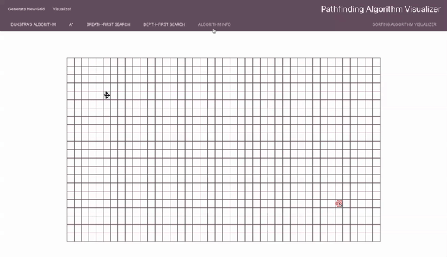

# Pathfinding Algorithm Visualizer

## Table of Contents

- [Contributors](#contributors)
- [Installation](#installation)
- [Deployed Link](#deployed-link)
- [Summary](#summary)
  - [Setting Up the Sort](#setting-up-the-sort)
  - [Sort!](#sort!)
  - [Example Algorithms](#example-algorithms)
  - [Info Page](#info-page)

## Contributors

<a href="https://github.com/dyson1602" >Christopher Michael Clark</a> & <a href="https://github.com/mkoenke" >Mary Rachael Koenke</a>

## Installation

If you wish to install on your local machine, first fork and clone the repo.
After you have completed cloning, simply run the following `npm` commands to get
it running on a local server:

npm

```
$ cd <app's main directory>
$ npm install
$ npm start
```

## Deployed Link

Click <a href="https://mkoenke.github.io/pathfinding-visualizer/">here</a> to vist our app in
your browser and play around with it before installation.

## Summary

### Setting Up the Sort


When the user first lands on Pathfinding Algorithm Visualizer they are met with a
series of options. There is a **_start node_** and **_end node_** that allows the user to change the starting and ending point of the pathfinder. The user can click and drag anywhere on the graph to generate walls on the grid. To reset the grid, the user can click on
`Generate New Grid`.
<br/>

### Visualize!

The user can then select a pathfinding algorithm method from the choices in the tool bar.
Once a selection has been made a user can click the `Visualize!`
button. Upon clicking it the algorithm will begin to go to work. During this time
all other options are muted except for the Algorithm Info link,
and the <a href="https://github.com/dyson1602/sorting-visualizer">Sorting Algorithm Visualizer</a> link.
<br/>

### Example Algorithms

#### Dijkstra's Algorithm


#### A\*


#### Depth-First Search


### Info Page



When the user clicks **_Algorithm Info_** they are directed to a separate page.
This page has a series of cards that the user can click on to display information
about each algorithm. The information includes time complexity, space complexity, and psuedocode desciptions as to how the algorithm functions.
